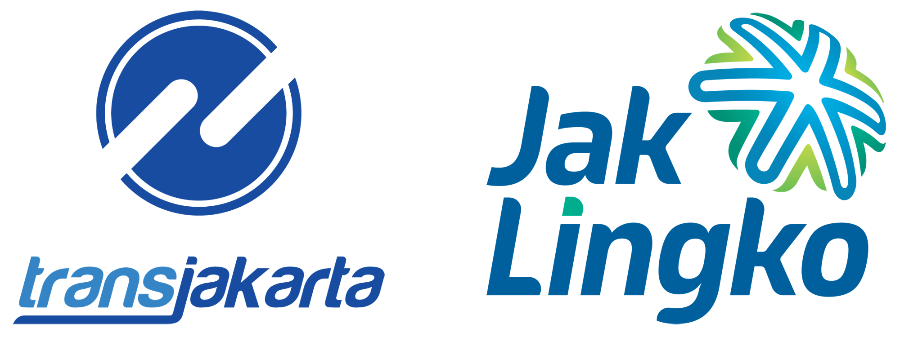

# Transjakarta: Enhancing Operational Efficiency and Customer Satisfaction

## Overview

Transjakarta faces significant challenges with route efficiency and congestion, particularly during peak hours. These issues lead to extended travel times, variability in trip durations, and decreased customer satisfaction. The goal of this analysis is to identify and address these inefficiencies to improve operational performance and enhance the overall customer experience.

## Objectives

- **Improve Route Efficiency**: Optimize routes to reduce travel times and congestion, particularly during peak hours.
- **Enhance Customer Satisfaction**: Ensure more consistent and reliable travel times to improve the dependability of the service.
- **Increase Operational Performance**: Identify and implement operational changes to better manage peak hour demand and reduce delays.

## Scope:

- **Time Frame**: Analysis will focus on April 2023 of operational data.
- **Geographical Region**: All routes serviced by Transjakarta within Jakarta will be included.
- **Data Sources**: Transjakarta Dummy dataset
- **Exclusions**: The analysis will exclude external factors not directly controllable by Transjakarta, such as traffic accidents or road construction activities not routinely affecting the routes.

## Technologies Used

- **Python**: For data cleaning and initial analysis.
- **Tableau**: To create interactive dashboards and visualizations.
- **GitHub**: For version control and collaboration.

## Getting Started

1. **Clone the Repository**:

## Visualization Tableu
https://public.tableau.com/views/TransJakartaCongestionAnalysis/TransJakartacongestionAnalysis?:language=en-US&:sid=&:redirect=auth&:display_count=n&:origin=viz_share_link

## Contribute

If you'd like to contribute, feel free to contact me here:

  
